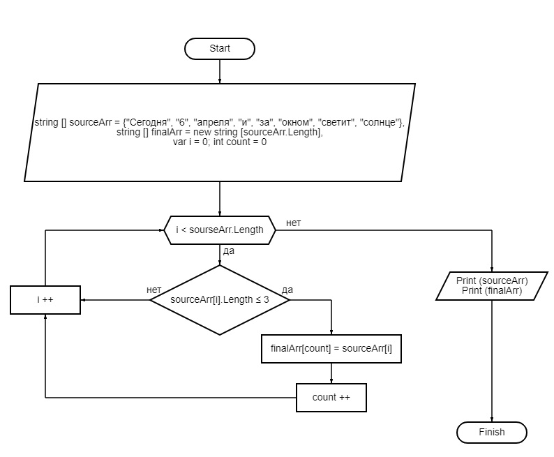

# Итоговая проверочная работа.
## Задача:
Написать программу, которая из имеющегося массива строк формирует массив из строк, длина которых меньше либо равна 3 символа. Первоначальный массив можно ввести с клавиатуры, либо задать на старте выполнения алгоритма. При решении не рекомендуется пользоваться коллекциями, лучше обойтись исключительно массивами.

## Решение:
1. Нарисуем блок-схему алгоритма решения задачи.

Алгоритм выглядит следующим образом:




2. Напишем программу для решения данной задачи.

+ Задаём исходный массив строк
```
string[] sourceArr = { "Сегодня", "6", "апреля", "и", "за", "окном", "светит", "солнце", "!" }
```
+ Определяем конечный массив строк, длина которого равна длине исходного массива
```
string[] finalArr = new string [sourseArr.Length]
```
+ Определяем переменные: счетчик для цикла for ***var i = 0*** и количество элементов в конечном массиве ***int count = 0***.

+ Для создания нового массива, который будет удовлетворять условию задачи: *длина элементов массива меньше либо равна 3 символа*, будем использовать метод **GetArray**.
    + С помощью цикла for, перебираем каждый элемент массива *sourceArr*, и если он меньше или равен 3 символа, то кладем его в конечный массив строк *finalArr*, увеличивая при этом переменную *count* на 1;
    + Когда цикл for завершится, изменяем количество элементов в конечном массиве *finalArr* до указанной величины *count* с помощью встроенного метода **Array.Resize**.
+ Для вывода массивов на экран используем метод **PrintArray**, который принимает массив строк, перебирает каждую строку массива с помощью цикла foreach и выводит на экран массив в одну строку.
3. Задача решена.

